# ProfileForge — Research Graph & Improvement Insights

## RESEARCH GRAPH (Mermaid)

```mermaid
graph TB
    subgraph RESEARCH["📚 2-HOUR RESEARCH"]
        R1[618 pub.dev packages]
        R2[5 premium apps reverse-engineered]
        R3[55 verified sound effects]
        R4[15+ verified Lottie URLs]
        R5[Spring physics presets]
        R6[GLSL shader examples]
        R7[Accessibility patterns]
        R8[M3 motion system]
    end

    subgraph EXISTING["✅ ALREADY BUILT IN CODEBASE"]
        E1[premium_animations.dart<br/>Haptics, WidgetAnimationX, StaggeredReveal, ConfettiCelebration]
        E2[app_theme.dart<br/>Lusion-inspired dark palette, glassmorphism surfaces]
        E3[premium_widgets.dart<br/>GlassCard, GradientButton, + more]
        E4[sound_service.dart<br/>audioplayers, PlayerMode.lowLatency]
        E5[celebrate.dart<br/>Overlay confetti + floating XP popup]
        E6[AnimationService.dart<br/>Duration tokens, curve tokens, stagger helpers]
        E7[pure_flutter_components.dart<br/>10 zero-dep components]
    end

    subgraph GAPS["🔴 GAPS IDENTIFIED"]
        G1[No shimmer/skeleton loading]
        G2[No staggered list animations in screens]
        G3[No tilt/parallax card effects]
        G4[No custom page transitions]
        G5[No animated gradient backgrounds]
        G6[No Lottie animations used yet]
        G7[No sound effects wired to animations]
        G8[No reduced motion support]
        G9[No AnimatedList for add/remove]
        G10[No pull-to-refresh animation]
    end

    subgraph IMPROVEMENTS["🎯 HIGH-IMPACT IMPROVEMENTS"]
        I1[Wire sound effects to Haptics class]
        I2[Add shimmer loading to all data screens]
        I3[Add staggered entrance to mission list]
        I4[Add tilt effect to profile cards]
        I5[Add Lottie for onboarding/success states]
        I6[Add custom page transitions]
        I7[Add reduced motion support]
        I8[Add pull-to-refresh to mission list]
    end

    %% Research → Existing connections
    R1 --> E1
    R1 --> E4
    R2 --> E2
    R2 --> E3
    R5 --> E1
    R8 --> E6

    %% Research → Gaps connections
    R1 -.-> G1
    R1 -.-> G9
    R1 -.-> G10
    R2 -.-> G2
    R2 -.-> G3
    R2 -.-> G4
    R4 -.-> G6
    R3 -.-> G7
    R7 -.-> G8

    %% Gaps → Improvements connections
    G1 --> I2
    G2 --> I3
    G3 --> I4
    G4 --> I6
    G5 --> I5
    G6 --> I5
    G7 --> I1
    G8 --> I7
    G9 --> I3
    G10 --> I8

    %% Existing → Improvements connections
    E1 --> I1
    E4 --> I1
    E6 --> I3
```



---

## GRAPH INSIGHTS

### Insight 1: Sound-Haptic Sync Gap
**Research found**: Duolingo syncs haptics with animations at animation peak.
**Codebase state**: `Haptics` class and `SoundService` exist but are **disconnected**. No screen wires them together.
**Action**: Create `HapticSoundSync` utility that fires haptic + sound at animation peak.

### Insight 2: Shimmer Loading Missing
**Research found**: Every premium app uses skeleton loading (Duolingo, Linear, Streaks).
**Codebase state**: Loading states use `CircularProgressIndicator()` (line 58, home_page.dart).
**Action**: Replace all `CircularProgressIndicator` with shimmer skeletons using `Shimmer.fromColors`.

### Insight 3: Staggered Lists Not Used in Screens
**Research found**: Staggered entrance animations create premium feel (Linear, Duolingo).
**Codebase state**: `StaggeredReveal` widget exists but screens don't use it consistently.
**Action**: Wrap all `ListView.builder` items with `AnimationConfiguration.staggeredList`.

### Insight 4: No Tilt/Parallax Effects
**Research found**: `flutter_tilt` adds gyroscope-driven depth (premium feel).
**Codebase state**: All cards are flat `GlassCard` widgets.
**Action**: Add `flutter_tilt` to profile cards and streak cards for depth.

### Insight 5: Lottie Animations Unused
**Research found**: 15+ verified free Lottie URLs for onboarding, success, loading, error.
**Codebase state**: No Lottie files in assets, no `lottie` package in use.
**Action**: Add `lottie` package, download onboarding/success animations, wire to screens.

### Insight 6: Sound Effects Not Wired
**Research found**: 55 verified Mixkit sounds downloaded (25MB).
**Codebase state**: `SoundService` exists with named effects but no actual WAV files in assets.
**Action**: Copy best 6 sounds to `assets/audio/`, wire to `SoundService` calls.

### Insight 7: No Custom Page Transitions
**Research found**: Premium apps use SharedAxisTransition, ContainerTransform, FadeThrough.
**Codebase state**: `go_router` with default transitions.
**Action**: Add `PageRouteBuilder` with custom curves to key navigation routes.

### Insight 8: No Reduced Motion Support
**Research found**: `MediaQuery.disableAnimationsOf(context)` is required for accessibility.
**Codebase state**: No reduced motion checks anywhere.
**Action**: Add wrapper utility that skips animations when user has reduce motion enabled.

---

## IMPLEMENTATION PRIORITY (Ordered by Impact × Effort)

### 🔴 P0 — Quick Wins (1-2 hours each)
1. **Wire sounds to animations** — Copy 6 best WAVs to `assets/audio/`, update `SoundService` paths
2. **Add shimmer loading** — Replace `CircularProgressIndicator` with shimmer skeletons
3. **Add reduced motion** — Create `AnimationConfig` InheritedWidget that disables animations

### 🟡 P1 — High Impact (2-4 hours each)
4. **Staggered list entrance** — Wrap mission list, achievements, leagues with stagger
5. **Lottie onboarding** — Download rocket/checkmark animations, add to onboarding flow
6. **Custom page transitions** — Add SharedAxisTransition to tab navigation

### 🟢 P2 — Polish (1-2 hours each)
7. **Tilt cards** — Add `flutter_tilt` to profile/streak cards
8. **Pull-to-refresh** — Add `custom_refresh_indicator` to mission list
9. **Animated backgrounds** — Add aurora/gradient shader to splash/home

---

## CODEBASE ARCHITECTURE (for reference)

```
lib/
├── core/
│   ├── animations/
│   │   ├── premium_animations.dart  ← Haptics, WidgetAnimationX, StaggeredReveal, ConfettiCelebration
│   │   └── AnimationService.dart    ← Duration tokens, curve tokens, stagger helpers
│   ├── audio/
│   │   ├── sound_service.dart       ← audioplayers, PlayerMode.lowLatency
│   │   └── sound_provider.dart      ← Riverpod provider
│   ├── celebration/
│   │   └── celebrate.dart           ← Overlay confetti + floating XP popup
│   ├── theme/
│   │   └── app_theme.dart           ← Palette, AppTheme, isDark()
│   ├── widgets/
│   │   └── premium_widgets.dart     ← GlassCard, GradientButton, + more
│   └── ...
├── features/
│   ├── home/home_page.dart          ← Main dashboard (743 lines)
│   ├── missions/                    ← Mission system
│   ├── streak/                      ← Streak tracking
│   ├── profile/                     ← User profile
│   ├── achievements/                ← Achievement badges
│   ├── leagues/                     ← League rankings
│   ├── xp/                          ← XP system
│   ├── onboarding/                  ← Onboarding flow
│   ├── timer/                       ← Focus timer
│   ├── skins/                       ← Visual skins
│   ├── rewards/                     ← Daily rewards
│   └── ...
└── main.dart
```

---

## KEY FILES TO MODIFY

| File | Current State | Improvement |
|------|--------------|-------------|
| `lib/core/audio/sound_service.dart` | Has named effects but no WAV files | Wire to downloaded Mixkit sounds |
| `lib/core/animations/premium_animations.dart` | Full animation toolkit | Add shimmer, tilt, Lottie wrappers |
| `lib/core/animations/AnimationService.dart` | Duration/curve tokens | Add spring presets, reduced motion |
| `lib/features/home/home_page.dart` | Uses CircularProgressIndicator | Replace with shimmer skeleton |
| `lib/features/missions/presentation/missions_screen.dart` | Basic list | Add staggered entrance, pull-to-refresh |
| `lib/features/streak/presentation/streak_card.dart` | Basic card | Add tilt effect, animated ring |
| `lib/features/onboarding/presentation/onboarding_screen.dart` | Basic flow | Add Lottie animations |
| `lib/core/navigation/app_router.dart` | Default transitions | Add custom page transitions |
